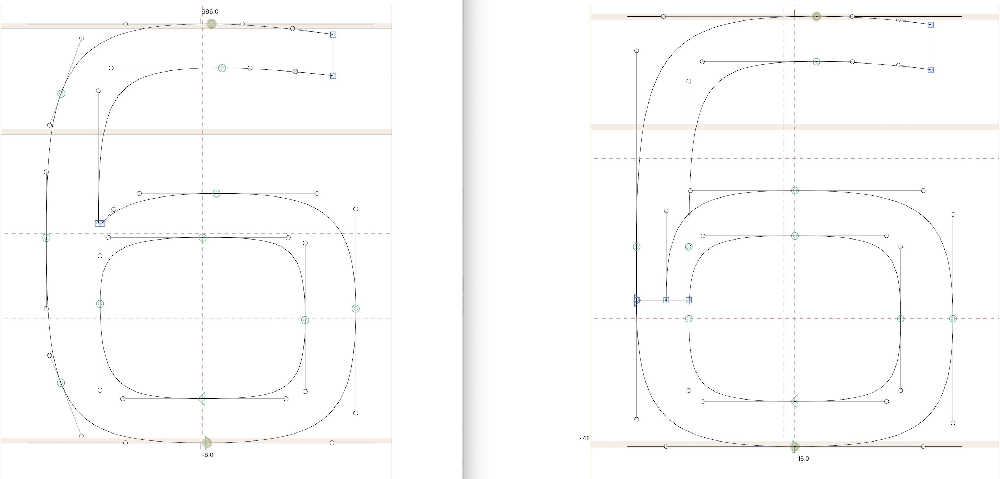
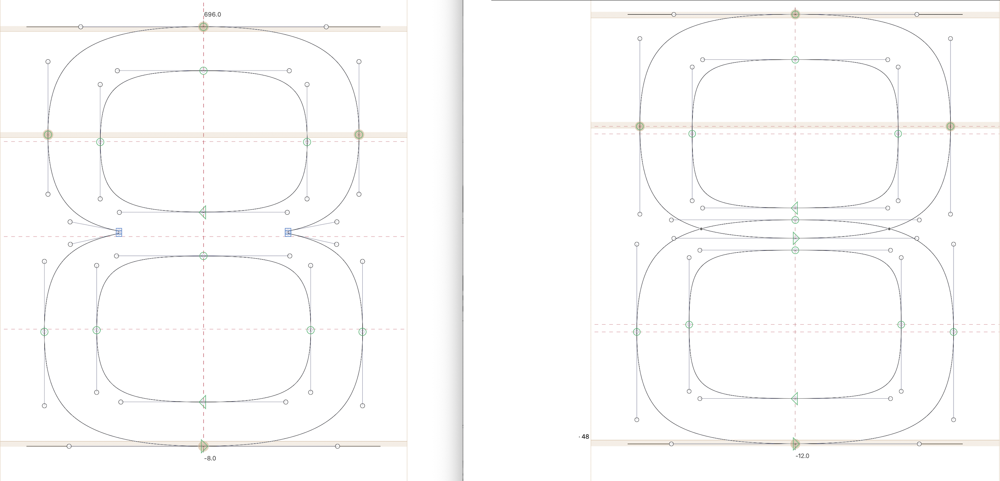
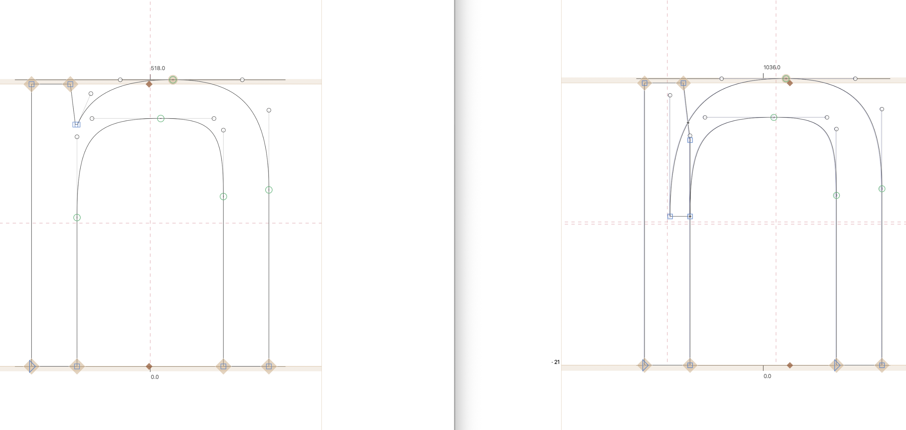

# Saira Parametric
Parametric version of Saira made with AVAR2 data (WIP)

This project explores the use of parametric axes and AVAR2 technology in an updated version of the Saira typeface. The first stage focuses on a limited set of glyphs (uppercase, lowercase, numbers, and basic punctuation within the GF Latin Kernel) as a proof of concept to estimate the technical requirements and production effort needed to adapt it to the full Saira character set. The original masters were designed by Héctor Gatti. The character sets were later completed by the Omnibus-Type Team.

Omnibus-Type Team SIL Open Font License 1.1

#1 Ago 2026

The main directive following the last meeting was to focus solely on the numerals (0–9), redesigning them from scratch using a 2000-unit UPM scale.

The workflow was as follows:

1. Scaling from 1000 to 2000 UPM.
2. Preliminary analysis of the main axes (masters):
- Existing drawings and their basic structural characteristics. 
- Drawing points and BCPs (Bézier control points) and their relationships across masters.
3. Redesigning the construction method for the characters to minimize the need for tertiary axes intended to resolve issues arising from drawing inconsistencies.
4. After making the necessary adjustments based on the analysis, the primary and secondary axes were rebuilt.
5. To adjust vertex tension, a tertiary axis named VENU (VERTICES NUMEROS) was added to balance stroke transitions. 
- This axis primarily affects the minimum weight.
6. The XTSP axis was reconfigured to a range of 0–300.

Next steps:

1. To review and to adjust proportions that don't behave harmoniously across the entire design space.
2. To experiment with cross-axis mapping to determine appropriate values ​​for each position within the design space.
3. Once the approach taken for the numerals is validated, the same process can be applied to uppercase and lowercase letters. See: lowercase 'n'.

Examples:

Left: Saira Variable. | Right: Saira Parametric

